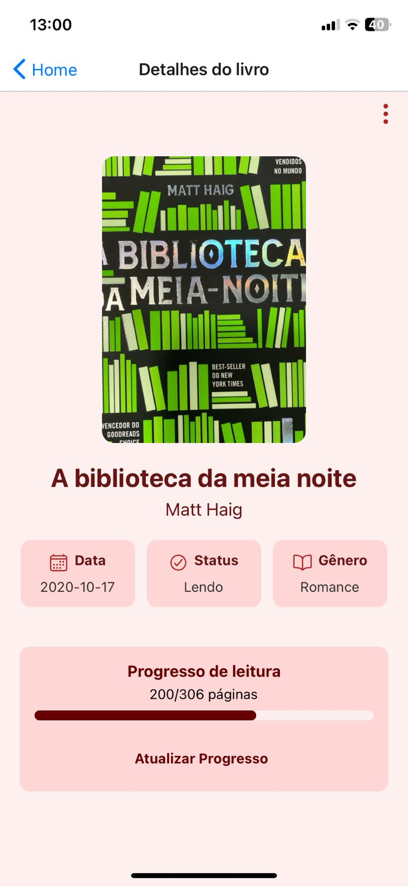
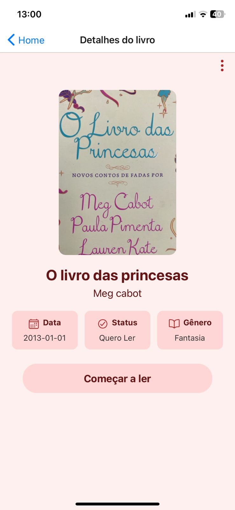
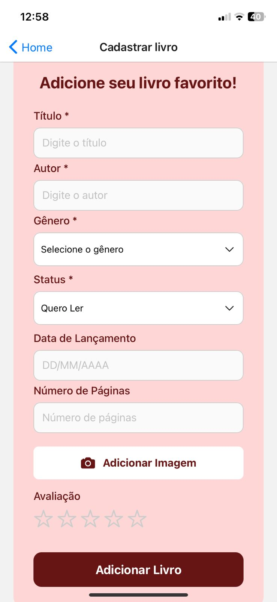
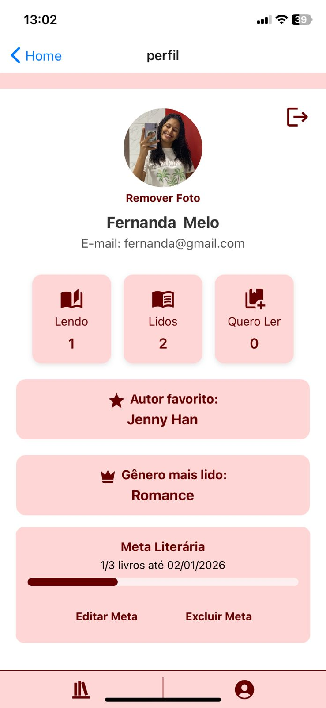

# 📚 Meu Cantinho Literário

O **Meu Cantinho Literário** é um aplicativo mobile desenvolvido para ajudar leitores a organizar, gerenciar e acompanhar sua coleção de livros de forma prática, intuitiva e totalmente personalizada.  
Ele funciona como uma biblioteca digital completa, permitindo ao usuário cadastrar seus livros, acompanhar progresso de leitura, definir metas e visualizar estatísticas sobre seus hábitos literários.

---

## 🖼️ Prévia do App

### 🔐 **Login & Principal**
| Login | Principal |
|-------|-----------|
|  |  |

### 📘 **Descrição do Livro**
| Livro 1 | Livro 2 | Livro 3 |
|---------|---------|---------|
|  |  |  |

### 📝 **Cadastro & Perfil**
| Cadastro | Perfil |
|----------|--------|
|  |  |
---

---

## ✨ Principais Funcionalidades

---

### 👤 **Conta e Perfil**
- Criação de conta com nome, sobrenome, e-mail e senha  
- Login rápido e seguro  
- Perfil com foto, nome e e-mail  
- Exibição de status de leitura: **Lendo**, **Lidos** e **Quero Ler**  
- Estatísticas personalizadas no perfil (autor favorito, gênero mais lido)

---

### 📘 **Gerenciamento de Livros**
- Cadastro de livros com título, autor, categoria e capa  
- Upload de fotos da câmera ou galeria  
- Organização por status:  
  - **Quero Ler**  
  - **Lendo**  
  - **Lido**  
- Busca e filtros para encontrar livros rapidamente  
- Edição completa (dados e foto)  
- Exclusão de livros cadastrados

---

### 📖 **Leitura e Progresso**
- Atualização do progresso através das páginas lidas  
- Barra visual de progresso  
- Botão **“Começar a Ler”** para livros adicionados como Quero Ler  
- Feedback completo ao finalizar um livro:
  - Avaliação de **1 a 5 estrelas**  
  - Comentário sobre a leitura  

---

### 🎯 **Metas Literárias**
- Criação de metas de leitura personalizadas  
- Definição de quantidade de livros e prazo  
- Progresso da meta em tempo real  
- Edição e exclusão de metas  
- Motivação extra para manter a rotina de leitura

---

### 📊 **Estatísticas Inteligentes**
- Gênero mais lido  
- Autor favorito  
- Total de livros por status  
- Evolução como leitor ao longo do tempo  

---

## 🎨 Interface
- Visual elegante e minimalista  
- Tela inicial exibindo todos os livros  
- Navegação inferior intuitiva  
- Telas dinâmicas conforme o status do livro  

---

## 💻 Tecnologias Utilizadas
- **React Native**  
- **Firebase Authentication**  
- **Firebase Firestore**  
- **React Navigation**  
- **AsyncStorage**  
